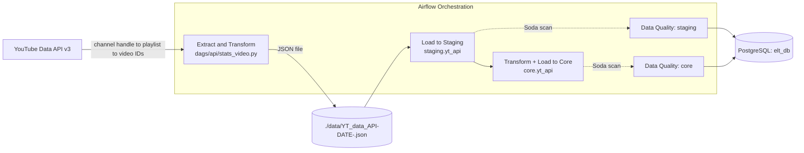

# Extract-Load-Transform (ELT): Simulating Automation ELT with Validation and End-to-End CI-CD Project

A production-style **ELT (Extract–Load–Transform) data pipeline** that pulls video metadata from the YouTube Data API v3, lands it in PostgreSQL, models it into a two-layer warehouse (`staging` → `core`), and validates it at every stage with automated data-quality checks — all orchestrated by Apache Airflow, containerized with Docker, and shipped through a GitHub Actions CI/CD pipeline.

---

## 1. Overview

`de_datapipeline` continuously tracks a YouTube channel's video catalog (views, likes, comments, duration, publish date, etc.), keeping a PostgreSQL warehouse in sync with the channel's current state — including inserts, updates, and deletions (videos removed or made private are also cleaned out of the tables).

The pipeline is built around **three chained Airflow DAGs**:

| DAG | Purpose | Trigger |
|---|---|---|
| `produce_json` | Calls the YouTube API, extracts video statistics, and saves them to a dated JSON file | Scheduled daily at `09:00` (Asia/Jakarta) |
| `update_db` | Loads the JSON file into a `staging` table, then transforms/loads it into a `core` table | Triggered automatically by `produce_json` |
| `data_quality` | Runs Soda Core checks against the `staging` and `core` schemas | Triggered automatically by `update_db` |

## 2. Architecture & Data Flow



**Step-by-step flow**

1. **Extract** — `get_playlist_id()` resolves the channel's uploads playlist via its handle, `get_video_ids()` paginates through all videos in that playlist, and `extract_video_data()` fetches statistics (views, likes, comments, duration, title, publish date) for every video in batches of 50.
2. **Save** — `save_to_json()` writes the extracted records to `./data/YT_data_API<YYYY-MM-DD>.json`.
3. **Load → Staging** — `staging_table()` creates the `staging` schema/table if needed, then upserts each record (insert new videos, update changed ones, delete videos no longer present in the source JSON).
4. **Transform → Core** — `core_table()` reads from `staging.yt_api`, applies business transformations (parses ISO-8601 durations into `TIME`, classifies each video as `Normal`, `Short`, or `Unavailable`), and upserts the result into `core.yt_api`.
5. **Validate** — `data_quality` runs [Soda Core](https://www.soda.io/core) checks (completeness, uniqueness, format, business-rule, and temporal validations) against both the `staging` and `core` schemas.

## 3. Tech Stack & Tools

| Category | Technology |
|---|---|
| **Orchestration** | Apache Airflow 2.9.2 (CeleryExecutor) |
| **Language** | Python 3.10 |
| **Database** | PostgreSQL 13 (separate DBs for Airflow metadata, Celery result backend, and the ELT warehouse) |
| **Task Queue / Broker** | Redis 7.2 |
| **Data Quality** | Soda Core (`soda-core-postgres` 3.3.14) |
| **External API** | YouTube Data API v3 |
| **Testing** | Pytest 8.3.3 (unit, integration, and Airflow DAG/E2E tests) |
| **Containerization** | Docker & Docker Compose |
| **CI/CD** | GitHub Actions (build & push Docker image, run tests, run E2E DAG tests) |
| **Image Registry** | Docker Hub |
| **DB Driver** | psycopg2 |
| **DB Client** | DBeaver (inspecting/querying the `staging` → `core` warehouse) |

## 4. Project Structure

```
de_datapipeline/
├── .github/workflows/
│   └── ci-cd_yt_elt.yaml        # CI/CD: build/push image, run unit/integration/E2E tests
├── dags/
│   ├── main.py                  # Defines the 3 DAGs: produce_json, update_db, data_quality
│   ├── api/
│   │   └── stats_video.py       # YouTube API extraction tasks
│   ├── datawarehouse/
│   │   ├── dwh.py               # staging_table() / core_table() task definitions
│   │   ├── data_loading.py      # Reads the daily JSON extract
│   │   ├── data_modification.py # insert / update / delete row helpers
│   │   ├── data_transformation.py # Duration parsing & video-type classification
│   │   └── data_utils.py        # Postgres connection, schema/table DDL helpers
│   └── dataquality/
│       └── soda.py              # Builds the Soda scan BashOperator task
├── data/                        # Daily JSON extracts (YT_data_API<date>.json)
├── docker/postgres/
│   └── init-multiple-databases.sh # Bootstraps the 3 Postgres databases/users on first run
├── include/soda/
│   ├── configuration.yml        # Soda data source configuration
│   ├── staging_checks.yml       # Data quality checks for the staging schema
│   └── core_checks.yml          # Data quality checks for the core schema
├── tests/
│   ├── conftest.py              # Shared pytest fixtures (mocked & real connections)
│   ├── unit_test.py             # Variable/connection mocks + DAG integrity checks
│   └── integration_test.py      # Live YouTube API & Postgres connectivity checks
├── docker-compose.yaml          # Airflow (webserver/scheduler/worker/init), Redis, Postgres
├── dockerfile                   # Custom Airflow image (installs requirements.txt)
├── requirements.txt             # soda-core-postgres, pytest
└── .gitignore
```

## 5. Data Model

Both schemas share the same core columns; `core` adds a derived `Video_Type` column.

**`staging.yt_api`**

| Column | Type |
|---|---|
| Video_Id | `VARCHAR` (PK) |
| Video_Title | `TEXT` |
| Upload_Date | `TIMESTAMP` |
| Duration | `VARCHAR` (raw ISO-8601, e.g. `PT26M38S`) |
| Video_Views | `BIGINT` |
| Likes_Count | `BIGINT` |
| Comments_Count | `BIGINT` |

**`core.yt_api`**

| Column | Type |
|---|---|
| Video_Id | `VARCHAR` (PK) |
| Video_Title | `TEXT` |
| Upload_Date | `TIMESTAMP` |
| Duration | `TIME` (parsed) |
| Video_Type | `VARCHAR` (`Normal` \| `Short` \| `Unavailable`) |
| Video_Views | `BIGINT` |
| Likes_Count | `BIGINT` |
| Comments_Count | `BIGINT` |

## 6. Inspecting the Warehouse (DBeaver)

The `staging` and `core` schemas live in the `elt_db` Postgres database (see `docker-compose.yaml` / `docker/postgres/init-multiple-databases.sh`) and can be explored with [DBeaver](https://dbeaver.io/) — useful for validating the `staging` → `core` upsert flow and inspecting the effects of the Soda data-quality checks.

**Connection settings** (mirroring `POSTGRES_CONN_HOST` / `POSTGRES_CONN_PORT` and the `ELT_DATABASE_*` variables):

| Field | Value |
|---|---|
| Host | `localhost` (or `POSTGRES_CONN_HOST` if connecting from another container) |
| Port | value of `POSTGRES_PORT` (mapped in `docker-compose.yaml`) |
| Database | value of `ELT_DATABASE_NAME` |
| Username | value of `ELT_DATABASE_USERNAME` |
| Password | value of `ELT_DATABASE_PASSWORD` |

Once connected, expand the database → **Schemas** to browse `staging.yt_api` and `core.yt_api` side by side and compare raw vs. transformed records.

## 7. Data Quality

Both `staging_checks.yml` and `core_checks.yml` enforce checks such as:

- **Completeness** — no missing values in key columns, `row_count > 0`
- **Uniqueness** — no duplicate `Video_Id`, valid 11-character YouTube ID format
- **Business rules** — likes/comments cannot exceed views; `Video_Type` restricted to `Normal`/`Short`/`Unavailable`; duration must match the classified type
- **Temporal validity** — upload date can't be in the future or before YouTube's founding (2005-04-23)
- **Numeric sanity** — no negative view/like/comment counts

Checks run via the Soda CLI:
```bash
soda scan -d pg_datasource -c include/soda/configuration.yml -v SCHEMA=<schema> include/soda/<schema>_checks.yml
```

## 8. Getting Started

### Prerequisites

- Docker & Docker Compose
- A YouTube Data API v3 key and the target channel's handle
- At least 4 GB RAM / 2 CPUs / 10 GB disk available to Docker

### Setup

1. **Clone the repository**
   ```bash
   git clone https://github.com/Enpewww/de_datapipeline.git
   cd de_datapipeline
   ```

2. **Configure environment variables** required by `docker-compose.yaml` (Airflow admin credentials, Fernet key, Docker Hub namespace/repo, Postgres connection details for the metadata/Celery/ELT databases, and the YouTube `API_KEY`/`CHANNEL_HANDLE`). Provide these via your own `.env` file or by exporting them in your shell — do not commit this file to version control.
   > `docker-compose.yaml` has the `env_file: .env` directives commented out by default (they're disabled for CI). Uncomment them for local runs, or export the variables in your shell.

3. **Start the stack**
   ```bash
   docker compose up airflow-init   # first-time DB migration & admin user creation
   docker compose up -d
   ```

4. **Access the Airflow UI** at `http://localhost:8080` (default credentials from `_AIRFLOW_WWW_USER_*`) and unpause the `produce_json`, `update_db`, and `data_quality` DAGs.

## 9. Testing

```bash
docker exec -t airflow-worker sh -c "pytest tests/ -v"
```

- **`unit_test.py`** — validates Airflow Variable/Connection mocking and DAG integrity (correct DAG IDs and task counts).
- **`integration_test.py`** — verifies live connectivity to the YouTube API and the real Postgres ELT database.
- End-to-end DAG runs are exercised in CI via `airflow dags test <dag_id>` for all three DAGs.

## 10. CI/CD Pipeline

`.github/workflows/ci-cd_yt_elt.yaml` runs on pushes to `main`/`feature/*`, pull requests to `main`, a daily schedule, and manual dispatch:

1. **Build & push image** — builds the custom Airflow image (only when `dockerfile`/`requirements.txt` changed, or on schedule/manual runs) and pushes it to Docker Hub tagged `latest` and with the commit SHA.
2. **Test** — spins up the full `docker compose` stack, runs `pytest` unit/integration tests inside `airflow-worker`, and executes end-to-end `airflow dags test` runs for `produce_json`, `update_db`, and `data_quality`, then tears the stack down.

## 11. License

The `docker-compose.yaml` base configuration is adapted from the Apache Airflow project and licensed under the [Apache License 2.0](http://www.apache.org/licenses/LICENSE-2.0).
